# SMAD PickleBot

Automation platform for the SMAD Pickleball group. Handles court booking, player management, payment tracking, and WhatsApp communication.

## Features

### Court Booking Automation
- Automated daily court booking at The Athenaeum at Caltech
- Weekly recurring schedules with multi-court support
- Playwright browser automation with screenshot capture
- Email notifications with booking status

### Payment Management
- Automatic Venmo payment sync via Gmail Watch
- Real-time payment detection and recording
- WhatsApp thank-you DMs with balance updates
- Manual payment recording via CLI

### WhatsApp Integration
- Weekly availability poll creation
- Vote and payment reminders
- Balance DMs to players with outstanding balances
- Poll vote tracking via webhook

### Google Sheets Integration
- Player tracking and hours logging
- Attendance tracking with date columns
- Payment history and balance calculations
- Poll vote logging and audit trail

## Systems Architecture

```mermaid
---
title: SMAD Picklebot Systems Architecture
---
graph TB
    subgraph "Users"
        U1[SMAD Group Members]
        U2[Admin/Organizer]
    end

    subgraph "WhatsApp via GREEN-API"
        WA[WhatsApp Group<br/>SMAD Pickleball]
        GREENAPI[GREEN-API Service<br/>webhook.green-api.com]
    end

    subgraph "Google Cloud Platform"
        GCF[Cloud Function Gen2<br/>smad-whatsapp-webhook<br/>Poll Vote Processing]
        VENMO_CF[Cloud Function Gen2<br/>venmo-sync-trigger<br/>Auto Payment Sync]
        PUBSUB[Cloud Pub/Sub<br/>venmo-payment-emails topic]
        FS[Firestore<br/>Poll State & Logs]
        SCHEDULER[Cloud Scheduler<br/>Reliable Cron Jobs]
    end

    subgraph "Google Services"
        SHEETS[Google Sheets API<br/>2026 Pickleball Sheet<br/>+ Payment Log Sheet]
        GMAIL[Gmail API<br/>Watch + SMTP Notifications]
    end

    subgraph "Payment Services"
        VENMO[Venmo API<br/>unofficial venmo-api]
    end

    subgraph "Athenaeum Court"
        ATH[Athenaeum Portal<br/>Court Reservations]
    end

    subgraph "CLI Tools"
        BOOKING[court-booking.py<br/>Playwright Automation]
        PAYMENT[payments-management.py<br/>Venmo Sync CLI]
        WHATSAPP_CLI[smad-whatsapp.py<br/>WhatsApp Messaging]
        SMADCLI[smad-sheets.py<br/>Sheet Management]
        SHARED[shared/venmo_sync.py<br/>Shared Sync Module]
    end

    subgraph "GitHub Actions Workflows"
        GHA_BOOK[court-booking.yml<br/>Court Booking at Midnight]
        GHA_REMIND[vote-payment-reminders.yml<br/>Venmo Sync + DM Reminders]
        GHA_POLL[poll-creation.yml<br/>Sunday Poll Creation]
        GHA_GMAIL[gmail-watch-renewal.yml<br/>Every 6 Days]
        DEPLOY[deploy-webhook.yml<br/>Auto-deploy Cloud Functions]
        GHA_TF[terraform.yml<br/>Infrastructure as Code]
    end

    subgraph "Infrastructure as Code"
        TF[Terraform<br/>infra/terraform/]
        TF_STATE[GCS State Backend<br/>smad-pickleball-terraform-state]
    end

    subgraph "Configuration"
        ENV[.env / GitHub Secrets<br/>Credentials & Settings]
        CREDS[Service Account JSON<br/>smad-credentials.json]
    end

    %% User Interactions
    U1 -->|sends poll votes| WA
    U1 -->|pays via Venmo| VENMO
    U2 -->|creates polls| WA
    U2 -->|runs CLI tools| PAYMENT
    U2 -->|manages sheet| SMADCLI

    %% WhatsApp Webhook Flow
    WA <-->|WebSocket/API| GREENAPI
    GREENAPI -->|webhook POST| GCF

    %% Poll Cloud Function Processing
    GCF -->|read/write poll state| FS
    GCF -->|update attendance| SHEETS
    GCF -->|log poll events| SHEETS

    %% Gmail Watch → Pub/Sub → Venmo Sync Flow
    GMAIL -->|push notification<br/>new Venmo email| PUBSUB
    PUBSUB -->|trigger| VENMO_CF
    VENMO_CF -->|fetch transactions| VENMO
    VENMO_CF -->|record payments<br/>+ dedup| SHEETS
    VENMO_CF -->|send thank you DM<br/>with balance| GREENAPI

    %% Shared Module
    PAYMENT -->|imports| SHARED
    VENMO_CF -->|uses| SHARED
    SHARED -->|fetch transactions| VENMO
    SHARED -->|record payments| SHEETS

    %% Court Booking
    BOOKING -->|authenticate & book| ATH
    BOOKING -->|send booking status| GMAIL

    %% CLI WhatsApp Operations
    WHATSAPP_CLI -->|send balance DMs| GREENAPI
    WHATSAPP_CLI -->|send vote reminders| GREENAPI
    WHATSAPP_CLI -->|create weekly poll| GREENAPI
    WHATSAPP_CLI -->|read player data| SHEETS

    SMADCLI -->|read/write player data| SHEETS

    %% Cloud Scheduler triggers GitHub Actions
    SCHEDULER -->|11:55 PM PST| GHA_BOOK
    SCHEDULER -->|10:00 AM PST daily| GHA_REMIND
    SCHEDULER -->|10:00 AM PST Sunday| GHA_POLL
    SCHEDULER -->|6:00 PM PST every 6 days| GHA_GMAIL

    %% GitHub Actions Workflows
    GHA_BOOK -->|triggers at midnight| BOOKING
    GHA_REMIND -->|sync-venmo| PAYMENT
    GHA_REMIND -->|send-balance-dm| WHATSAPP_CLI
    GHA_REMIND -->|send-vote-reminders| WHATSAPP_CLI
    GHA_POLL -->|create-poll| WHATSAPP_CLI
    GHA_GMAIL -->|renew Gmail Watch| GMAIL
    DEPLOY -->|deploys on push to main| GCF
    DEPLOY -->|deploys on push to main| VENMO_CF

    %% Configuration
    ENV -.->|credentials| GCF
    ENV -.->|credentials| VENMO_CF
    CREDS -.->|authenticates| SHEETS

    %% Terraform Infrastructure
    GHA_TF -->|plan/apply| TF
    TF -->|manages| GCF
    TF -->|manages| VENMO_CF
    TF -->|manages| PUBSUB
    TF -->|stores state| TF_STATE

    %% Styling
    classDef userClass fill:#e1f5ff,stroke:#0066cc,stroke-width:2px
    classDef whatsappClass fill:#dcf8c6,stroke:#25d366,stroke-width:2px
    classDef gcpClass fill:#fff3e0,stroke:#ff9800,stroke-width:2px
    classDef googleClass fill:#f3e5f5,stroke:#9c27b0,stroke-width:2px
    classDef paymentClass fill:#e8f5e9,stroke:#4caf50,stroke-width:2px
    classDef athenaeumClass fill:#fce4ec,stroke:#e91e63,stroke-width:2px
    classDef cliClass fill:#e3f2fd,stroke:#2196f3,stroke-width:2px
    classDef cicdClass fill:#fff9c4,stroke:#fbc02d,stroke-width:2px
    classDef configClass fill:#f5f5f5,stroke:#757575,stroke-width:2px
    classDef terraformClass fill:#e8eaf6,stroke:#5c6bc0,stroke-width:2px

    class U1,U2 userClass
    class WA,GREENAPI whatsappClass
    class GCF,VENMO_CF,PUBSUB,FS,SCHEDULER gcpClass
    class SHEETS,GMAIL googleClass
    class VENMO paymentClass
    class ATH athenaeumClass
    class BOOKING,PAYMENT,WHATSAPP_CLI,SMADCLI,SHARED cliClass
    class GHA_BOOK,GHA_REMIND,GHA_POLL,GHA_GMAIL,DEPLOY,GHA_TF cicdClass
    class ENV,CREDS configClass
    class TF,TF_STATE terraformClass
```



## Scheduled Jobs

All workflows are triggered by **Google Cloud Scheduler** for reliable, timezone-aware scheduling:

| Job | Schedule (PST) | Workflow | Description |
|-----|----------------|----------|-------------|
| Court Booking | 11:55 PM daily | court-booking.yml | Books courts at 00:01 AM (7 days out) |
| Vote & Payment Reminders | 8:00 AM daily | vote-payment-reminders.yml | Syncs Venmo, sends balance DMs |
| Poll Creation | 10:00 AM Sunday | poll-creation.yml | Creates weekly availability poll |
| Gmail Watch Renewal | 6:00 PM on days 1,7,13,19,25 | gmail-watch-renewal.yml | Renews Gmail API watch |

## Documentation

### Setup Guides
- [Terraform Infrastructure](infra/terraform/README.md) - Infrastructure as Code for GCP resources
- [Cloud Scheduler Setup](gcp-scheduler/README.md) - Reliable scheduling via Google Cloud Scheduler
- [GitHub Actions Setup](GITHUB_ACTION_SETUP.md) - Workflow configuration and secrets
- [SMAD Google Sheets Setup](SMAD_SETUP.md) - Player tracking, hours logging, and payment management

### Feature Documentation
- [Court Booking](COURT_BOOKING.md) - Athenaeum court booking automation
- [Payment Management](PAYMENT_MANAGEMENT.md) - Venmo sync and payment tracking
- [WhatsApp Webhook](webhook/README.md) - Poll vote tracking via Cloud Functions
- [Venmo Email Sync](VENMO_EMAIL_SYNC_SETUP.md) - Real-time payment sync via Gmail Watch
- [Gmail Watch Setup](GMAIL_WATCH_SETUP.md) - Gmail API watch for Venmo notifications

## Quick Start

### Prerequisites
- Python 3.7+
- Google Cloud account with project `smad-pickleball`
- GREEN-API account for WhatsApp
- Gmail account for notifications

### Installation

```bash
# Clone repository
git clone https://github.com/genechuang/SMADPickleBot.git
cd SMADPickleBot

# Install dependencies
pip install -r requirements.txt

# For court booking
playwright install chromium

# Copy environment template
cp .env.example .env
# Edit .env with your credentials
```

### Infrastructure Setup

1. **Terraform** - Deploy GCP infrastructure:
   ```bash
   cd infra/terraform
   terraform init
   terraform apply
   ```

2. **Cloud Scheduler** - Set up scheduled jobs:
   ```powershell
   cd gcp-scheduler
   .\setup-scheduler.ps1
   ```

3. **GitHub Secrets** - Add credentials to repository settings

See individual setup guides above for detailed instructions.

## CLI Tools

### court-booking.py
Automated court booking with Playwright.

```bash
# Book using weekly schedule
python court-booking.py

# Manual booking
python court-booking.py --booking-date-time "01/20/2026 10:00 AM" --court "both"
```

### payments-management.py
Payment tracking and Venmo sync.

```bash
# Sync from Venmo
python payments-management.py sync-venmo

# Record manual payment
python payments-management.py record "John Doe" 50.00 --method venmo
```

### smad-whatsapp.py
WhatsApp messaging and polls.

```bash
# Create weekly poll
python smad-whatsapp.py create-poll

# Send vote reminders
python smad-whatsapp.py send-vote-reminders

# Send balance DMs
python smad-whatsapp.py send-balance-dm
```

### smad-sheets.py
Google Sheets management.

```bash
# Show player balances
python smad-sheets.py balances

# Add hours for a date
python smad-sheets.py add-hours "01/20/2026" 2.0
```

## Cost

| Service | Cost |
|---------|------|
| Google Cloud Functions | Free tier (2M invocations/month) |
| Cloud Scheduler | $0.10/month (4 jobs, 3 free) |
| Cloud Pub/Sub | Free tier |
| Google Sheets API | Free |
| Gmail API | Free |
| GitHub Actions | Free (2000 minutes/month) |
| **Total** | **~$0.10/month** |

## Security

- Credentials stored in GitHub Secrets (encrypted)
- Service account with minimal permissions
- OAuth tokens never committed to git
- Gmail read-only access for watch

## Contributing

This is a personal automation tool. If you find bugs or have improvements:
1. Test thoroughly before committing changes
2. Update documentation for any new features
3. Follow existing code patterns

## License

Personal use only. Respect The Athenaeum's and Venmo's terms of service.
