# Athenaeum Court Booking Automation

Automated court booking script for The Athenaeum at Caltech. Books pickleball and tennis courts with customizable date, time, court selection, and duration.

## Features

- ✅ **Weekly Recurring Bookings**: Schedule bookings for specific days of the week (e.g., "Tuesday 7:00 PM, Friday 4:00 PM")
- ✅ **Cloud Scheduler + GitHub Actions**: Reliable automated scheduling via Google Cloud Scheduler (no DST issues)
- ✅ **Multi-Court Booking**: Book both North and South Pickleball Courts simultaneously
- ✅ **Email Notifications**: Gmail SMTP status reports with booking details and screenshots
- ✅ Automated login to Athenaeum member portal
- ✅ Direct navigation to Court Reservations page
- ✅ Automatic court slot selection by date, time, and court name
- ✅ Configurable booking duration (60 or 120 minutes)
- ✅ Handles Telerik RadComboBox controls
- ✅ Automatic confirmation dialog closure
- ✅ Screenshot capture at each step for debugging
- ✅ Command-line arguments or environment variable configuration

## Systems Architecture

```mermaid
---
title: SMAD Picklebot Systems Architecture
---
graph TB
    subgraph "Users"
        U1[SMAD Group Members]
        U2[Admin/Organizer]
    end

    subgraph "WhatsApp via GREEN-API"
        WA[WhatsApp Group<br/>SMAD Pickleball]
        GREENAPI[GREEN-API Service<br/>webhook.green-api.com]
    end

    subgraph "Google Cloud Platform"
        GCF[Cloud Function Gen2<br/>smad-whatsapp-webhook<br/>Poll Vote Processing]
        VENMO_CF[Cloud Function Gen2<br/>venmo-sync-trigger<br/>Auto Payment Sync]
        PUBSUB[Cloud Pub/Sub<br/>venmo-payment-emails topic]
        FS[Firestore<br/>Poll State & Logs]
        SCHEDULER[Cloud Scheduler<br/>Reliable Cron Jobs]
    end

    subgraph "Google Services"
        SHEETS[Google Sheets API<br/>2026 Pickleball Sheet<br/>+ Payment Log Sheet]
        GMAIL[Gmail API<br/>Watch + SMTP Notifications]
    end

    subgraph "Payment Services"
        VENMO[Venmo API<br/>unofficial venmo-api]
    end

    subgraph "Athenaeum Court"
        ATH[Athenaeum Portal<br/>Court Reservations]
    end

    subgraph "CLI Tools"
        BOOKING[ath-booking.py<br/>Playwright Automation]
        PAYMENT[payments-management.py<br/>Venmo Sync CLI]
        WHATSAPP_CLI[smad-whatsapp.py<br/>WhatsApp Messaging]
        SMADCLI[smad-sheets.py<br/>Sheet Management]
        SHARED[shared/venmo_sync.py<br/>Shared Sync Module]
    end

    subgraph "GitHub Actions Workflows"
        GHA_BOOK[court-booking.yml<br/>Court Booking at Midnight]
        GHA_REMIND[vote-payment-reminders.yml<br/>Venmo Sync + DM Reminders]
        GHA_POLL[poll-creation.yml<br/>Sunday Poll Creation]
        GHA_GMAIL[gmail-watch-renewal.yml<br/>Every 6 Days]
        DEPLOY[deploy-webhook.yml<br/>Auto-deploy Cloud Functions]
    end

    subgraph "Configuration"
        ENV[.env / GitHub Secrets<br/>Credentials & Settings]
        CREDS[Service Account JSON<br/>smad-credentials.json]
    end

    %% User Interactions
    U1 -->|sends poll votes| WA
    U1 -->|pays via Venmo| VENMO
    U2 -->|creates polls| WA
    U2 -->|runs CLI tools| PAYMENT
    U2 -->|manages sheet| SMADCLI

    %% WhatsApp Webhook Flow
    WA <-->|WebSocket/API| GREENAPI
    GREENAPI -->|webhook POST| GCF

    %% Poll Cloud Function Processing
    GCF -->|read/write poll state| FS
    GCF -->|update attendance| SHEETS
    GCF -->|log poll events| SHEETS

    %% Gmail Watch → Pub/Sub → Venmo Sync Flow
    GMAIL -->|push notification<br/>new Venmo email| PUBSUB
    PUBSUB -->|trigger| VENMO_CF
    VENMO_CF -->|fetch transactions| VENMO
    VENMO_CF -->|record payments<br/>+ dedup| SHEETS
    VENMO_CF -->|send thank you DM<br/>with balance| GREENAPI

    %% Shared Module
    PAYMENT -->|imports| SHARED
    VENMO_CF -->|uses| SHARED
    SHARED -->|fetch transactions| VENMO
    SHARED -->|record payments| SHEETS

    %% Court Booking
    BOOKING -->|authenticate & book| ATH
    BOOKING -->|send booking status| GMAIL

    %% CLI WhatsApp Operations
    WHATSAPP_CLI -->|send balance DMs| GREENAPI
    WHATSAPP_CLI -->|send vote reminders| GREENAPI
    WHATSAPP_CLI -->|create weekly poll| GREENAPI
    WHATSAPP_CLI -->|read player data| SHEETS

    SMADCLI -->|read/write player data| SHEETS

    %% Cloud Scheduler triggers GitHub Actions
    SCHEDULER -->|11:55 PM PST| GHA_BOOK
    SCHEDULER -->|10:00 AM PST daily| GHA_REMIND
    SCHEDULER -->|10:00 AM PST Sunday| GHA_POLL
    SCHEDULER -->|6:00 PM PST every 6 days| GHA_GMAIL

    %% GitHub Actions Workflows
    GHA_BOOK -->|triggers at midnight| BOOKING
    GHA_REMIND -->|sync-venmo| PAYMENT
    GHA_REMIND -->|send-balance-dm| WHATSAPP_CLI
    GHA_REMIND -->|send-vote-reminders| WHATSAPP_CLI
    GHA_POLL -->|create-poll| WHATSAPP_CLI
    GHA_GMAIL -->|renew Gmail Watch| GMAIL
    DEPLOY -->|deploys on push to main| GCF
    DEPLOY -->|deploys on push to main| VENMO_CF

    %% Configuration
    ENV -.->|credentials| GCF
    ENV -.->|credentials| VENMO_CF
    CREDS -.->|authenticates| SHEETS

    %% Styling
    classDef userClass fill:#e1f5ff,stroke:#0066cc,stroke-width:2px
    classDef whatsappClass fill:#dcf8c6,stroke:#25d366,stroke-width:2px
    classDef gcpClass fill:#fff3e0,stroke:#ff9800,stroke-width:2px
    classDef googleClass fill:#f3e5f5,stroke:#9c27b0,stroke-width:2px
    classDef paymentClass fill:#e8f5e9,stroke:#4caf50,stroke-width:2px
    classDef athenaeumClass fill:#fce4ec,stroke:#e91e63,stroke-width:2px
    classDef cliClass fill:#e3f2fd,stroke:#2196f3,stroke-width:2px
    classDef cicdClass fill:#fff9c4,stroke:#fbc02d,stroke-width:2px
    classDef configClass fill:#f5f5f5,stroke:#757575,stroke-width:2px

    class U1,U2 userClass
    class WA,GREENAPI whatsappClass
    class GCF,VENMO_CF,PUBSUB,FS,SCHEDULER gcpClass
    class SHEETS,GMAIL googleClass
    class VENMO paymentClass
    class ATH athenaeumClass
    class BOOKING,PAYMENT,WHATSAPP_CLI,SMADCLI,SHARED cliClass
    class GHA_BOOK,GHA_REMIND,GHA_POLL,GHA_GMAIL,DEPLOY cicdClass
    class ENV,CREDS configClass
```



The diagram above shows the complete system architecture including:
- **Cloud Scheduler**: Google Cloud Scheduler triggers all GitHub Actions workflows via workflow_dispatch API (replaces unreliable GHA cron)
- **Court Booking**: Playwright automation for Athenaeum Court reservations, triggered at 12:00 AM PST
- **Google Sheets**: Central data store for player tracking, attendance, payments (Payment Log), and poll logs
- **Weekly Poll Creation**: Automated Sunday poll generation at 10:00 AM PST
- **Daily Reminders**: Vote and payment reminders sent at 10:00 AM PST daily
- **WhatsApp Poll Webhook**: Real-time poll vote processing via GREEN-API + Cloud Function
- **Gmail Watch + Venmo Sync**: Gmail API Watch detects Venmo payment emails, Pub/Sub triggers Cloud Function to auto-sync payments and send WhatsApp thank-you DMs with updated balances
- **Shared Sync Module**: Single source of truth (`shared/venmo_sync.py`) used by both Cloud Function and CLI, with deduplication for concurrent Gmail notifications
- **CI/CD**: Auto-deploys both Cloud Functions on push to main; Gmail Watch renewal every 6 days via Cloud Scheduler

## Documentation

- [Cloud Scheduler Setup](gcp-scheduler/README.md) - Reliable scheduling via Google Cloud Scheduler
- [GitHub Actions Setup](GITHUB_ACTION_SETUP.md) - Workflow configuration and secrets
- [SMAD Google Sheets Setup](SMAD_SETUP.md) - Player tracking, hours logging, and payment management
- [WhatsApp Webhook Setup](webhook/README.md) - Poll vote tracking via Google Cloud Functions
- [Payment Management](#payment-management) - Track payments via Venmo API integration

## Prerequisites

- Python 3.7+
- Playwright browser automation library

## Installation

1. Clone or download this repository

2. Install required dependencies:
```bash
pip install playwright python-dotenv
```

3. Install Playwright browsers:
```bash
playwright install chromium
```

## Configuration

### Environment Variables

Create a `.env` file in the project directory. See [.env.example](.env.example) for a complete template.

```env
# Required: Your Athenaeum login credentials
ATHENAEUM_USERNAME=your_username
ATHENAEUM_PASSWORD=your_password

# Weekly recurring bookings (for automated GitHub Actions scheduling)
# Format: <DayName> <Time HH:MM AM/PM>, comma-separated
# Day names: Monday, Tuesday, Wednesday, Thursday, Friday, Saturday, Sunday
BOOKING_LIST=Tuesday 7:00 PM,Wednesday 7:00 PM,Friday 4:00 PM,Sunday 10:00 AM

# Target booking time (24-hour format HH:MM:SS)
# Default: 00:00:15 (12:00:15 AM PST - when courts become available 7 days out)
BOOKING_TARGET_TIME=00:00:15

# Court to book: "both", "North Pickleball Court", or "South Pickleball Court"
# Set to "both" to automatically book both North and South courts
COURT_NAME=both

# Booking duration in minutes (60 or 120)
BOOKING_DURATION=120

# Single booking date/time (for manual runs without BOOKING_LIST)
# Format: MM/DD/YYYY HH:MM AM/PM
BOOKING_DATE_TIME=01/20/2026 10:00 AM

# Optional: Safety mode (set to False to actually complete bookings)
SAFETY_MODE=False

# Optional: Run in headless mode
HEADLESS=False

# Optional: Email Notifications (Gmail SMTP)
GMAIL_USERNAME=your_email@gmail.com
GMAIL_APP_PASSWORD=your_16_char_app_password
NOTIFICATION_EMAIL=recipient@gmail.com
```

**⚠️ Security Note:** Never commit your `.env` file to version control. Add it to `.gitignore`.

### Email Notifications (Optional)

The script can send booking status reports via Gmail SMTP with:
- Booking success/failure summary
- Individual booking details
- Screenshot attachments
- HTML-formatted email

**Setup Gmail App Password:**

1. Enable 2-Step Verification on your Google Account: https://myaccount.google.com/security
2. Generate an App Password: https://myaccount.google.com/apppasswords
3. Add to `.env`:
   ```env
   GMAIL_USERNAME=your_email@gmail.com
   GMAIL_APP_PASSWORD=abcd efgh ijkl mnop
   NOTIFICATION_EMAIL=recipient@gmail.com  # Optional, defaults to GMAIL_USERNAME
   ```

**For GitHub Actions:** Add these as repository secrets:
- `GMAIL_USERNAME`
- `GMAIL_APP_PASSWORD`
- `NOTIFICATION_EMAIL`

If email credentials are not configured, the script will skip email notifications and continue normally.

## Usage

### Two Operating Modes

#### 1. Booking List Mode (Automated Weekly Recurring)

When `BOOKING_LIST` is set in `.env`, the script operates in **Booking List Mode** for automated weekly bookings:

```bash
# Set in .env:
# BOOKING_LIST=Tuesday 7:00 PM,Wednesday 7:00 PM,Friday 4:00 PM,Sunday 10:00 AM
# COURT_NAME=both
# BOOKING_TARGET_TIME=00:00:15

# Run with invoke time (used by GitHub Actions)
python ath-booking.py --invoke-time "01-16-2026 23:55:00"

# Run without invoke time (books immediately for testing)
python ath-booking.py
```

**How it works:**
- Parses `BOOKING_LIST` and filters bookings for today's day of week
- If `--invoke-time` is provided (in PST/PDT): waits until `BOOKING_TARGET_TIME` (default 00:00:15 AM PST)
- Books courts **7 days in advance** (when courts become available)
- If `COURT_NAME=both`: books both North and South Pickleball Courts
- All timestamps and date handling use PST/PDT timezone

**Example:**
- GitHub Actions runs at 11:50 PM PST (Tuesday)
- Invoke time: `01-16-2026 23:50:00` PST
- `BOOKING_LIST=Tuesday 7:00 PM,Friday 4:00 PM`
- Script finds "Tuesday 7:00 PM", waits until 12:00:15 AM, then books next Tuesday (7 days out) at 7:00 PM

#### 2. Manual Single Booking Mode

When `BOOKING_LIST` is NOT set, use command-line arguments for one-time bookings:

```bash
# Full booking specification
python ath-booking.py --booking-date-time "01/20/2026 10:00 AM" --court "South Pickleball Court" --duration "120"

# Book both courts
python ath-booking.py --booking-date-time "01/20/2026 10:00 AM" --court "both" --duration "120"

# Partial arguments (rest use .env defaults)
python ath-booking.py --booking-date-time "01/21/2026 02:00 PM"

# Use all .env defaults
python ath-booking.py
```

### Command-Line Options

| Option | Description | Example |
|--------|-------------|---------|
| `--booking-date-time` | Booking date and time in MM/DD/YYYY HH:MM AM/PM format | `"01/20/2026 10:00 AM"` |
| `--court` | Court name or "both" (see available courts below) | `"South Pickleball Court"` or `"both"` |
| `--duration` | Duration in minutes (60 or 120) | `"120"` |
| `--invoke-time` | Invoke timestamp in MM-DD-YYYY HH:MM:SS format (PST/PDT) | `"01-16-2026 23:55:00"` |

### Available Courts

- `North Pickleball Court`
- `South Pickleball Court`
- `West Tennis Court`
- `East Tennis Court`
- `both` - Special value to book both North and South Pickleball Courts simultaneously

## GitHub Actions Automation

All workflows are triggered by **Google Cloud Scheduler** for reliable, timezone-aware scheduling.

**Scheduled Jobs:**
| Job | Schedule (PST) | Workflow |
|-----|----------------|----------|
| Court Booking | 11:55 PM daily | court-booking.yml (triggers early for warm-up; books at 00:01 AM) |
| Vote & Payment Reminders | 10:00 AM daily | vote-payment-reminders.yml |
| Poll Creation | 10:00 AM Sunday | poll-creation.yml |
| Gmail Watch Renewal | 6:00 PM on days 1,7,13,19,25 | gmail-watch-renewal.yml |

**Setup:** See [Cloud Scheduler Setup](gcp-scheduler/README.md) for configuration instructions.

**Key Features:**
- Reliable scheduling (no GHA cron issues)
- Automatic DST handling (America/Los_Angeles timezone)
- Weekly recurring bookings by day of week
- Multi-court booking support (`COURT_NAME=both`)

## How It Works

1. **Login**: Authenticates with your Athenaeum credentials
2. **Navigate**: Goes directly to Court Reservations page
3. **Find Slot**: Searches for available court slot matching your criteria
4. **Book**: Opens booking form modal (iframe)
5. **Set Duration**: Uses Telerik RadComboBox API to select duration
6. **Submit**: Clicks "Make Reservation" button
7. **Confirm**: Automatically closes confirmation dialog
8. **Screenshot**: Saves screenshots at each step for verification

## Screenshots

The script saves screenshots during execution:

- `before_login.png` - Login page
- `after_login.png` - After successful login
- `booking_page.png` - Court reservations page
- `booking_01_initial.png` - Calendar view
- `booking_03_target_slot.png` - Selected time slot
- `booking_04_booking_form.png` - Booking form modal
- `booking_05a_before_submit.png` - Before clicking submit
- `booking_06_confirmation.png` - Confirmation page

## Troubleshooting

### Issue: Login fails
**Solution:** Verify your credentials in `.env` file are correct

### Issue: Court slot not found
**Solution:**
- Check the date format is MM/DD/YYYY
- Verify the time format includes AM/PM
- Ensure the court name matches exactly (case-sensitive)
- The slot may already be booked - try a different time

### Issue: Duration not changing from 60 to 120 minutes
**Solution:** This script uses Telerik RadComboBox API. If it fails, check the console output for error messages.

### Issue: Modal/iframe not loading
**Solution:** The script waits for the iframe to load. If network is slow, you may need to increase wait times in the code.

### Issue: Unicode emoji errors on Windows
**Solution:** The script has been updated to use ASCII markers `[OK]`, `[ERROR]`, `[WARN]` instead of Unicode emojis for Windows compatibility.

## Safety Mode

Safety mode is controlled by the `SAFETY_MODE` environment variable in `.env`:

- `SAFETY_MODE=True` (default): Stops before clicking "Make Reservation" button
- `SAFETY_MODE=False`: Completes the full booking process

## Technical Details

### Key Technologies
- **Playwright**: Browser automation
- **Async/Await**: Asynchronous Python execution
- **Telerik RadComboBox**: Custom dropdown handling via JavaScript API

### Browser Configuration
- Uses Chromium browser
- Viewport: 1920x1080
- Configurable headless mode
- Network idle wait strategy

### Form Handling
The booking form uses Telerik RadComboBox controls, not standard HTML `<select>` elements. The script:
1. Detects Telerik controls by ID pattern
2. Uses `window.$find()` to get the combo object
3. Calls `findItemByText()` to locate the duration option
4. Uses `set_selectedIndex()` and `set_text()` to select it

## Payment Management

Track SMAD group payments with Venmo API integration.

### Quick Start

```bash
# Record a manual payment
python payments-management.py record "John Doe" 50.00 --method venmo

# Set up Venmo API access (one-time, requires 2FA)
python payments-management.py setup-venmo

# Sync payments from Venmo
python payments-management.py sync-venmo

# List recent payments
python payments-management.py list --days 30

# Show payment history for a player
python payments-management.py history "John Doe"
```

### Venmo Integration

The script uses the unofficial `venmo-api` library to fetch transactions:
- Matches payments by Venmo username (@handle) to the Venmo column in the main sheet
- Automatically skips already-recorded transactions (by transaction ID)
- Updates `Last Paid` date in the main sheet when payments are recorded

**Setup:**
1. Install: `pip install venmo-api`
2. Run: `python payments-management.py setup-venmo`
3. Complete 2FA verification
4. Add the token to `.env`: `VENMO_ACCESS_TOKEN=your_token`

### Payment Log Sheet

Payments are logged to a "Payment Log" sheet with columns:
- Date, Player Name, Amount, Method, Transaction ID, Notes, Recorded By, Recorded At

## Known Limitations

- Requires valid Athenaeum member credentials
- Court availability depends on club rules and reservation windows (typically 7 days in advance)
- May need updates if website structure changes
- Cloud Scheduler costs $0.10/month for the 4th job (free tier includes 3 jobs)

## Contributing

This is a personal automation tool. If you find bugs or have improvements:
1. Test thoroughly before committing changes
2. Update documentation for any new features
3. Maintain screenshot captures for debugging

## License

Personal use only. Respect The Athenaeum's terms of service.

## Disclaimer

This tool is for personal convenience and should be used responsibly:
- ⚠️ Do not abuse the booking system
- ⚠️ Follow all club rules and reservation policies
- ⚠️ Do not share your credentials
- ⚠️ The Athenaeum may modify their website at any time, breaking this script

## Version History

### v3.0 (Current)
- ✅ **Weekly Recurring Bookings**: BOOKING_LIST with day-of-week filtering (human-readable day names)
- ✅ **GitHub Actions Integration**: Automated daily scheduling with cron
- ✅ **Multi-Court Booking**: `COURT_NAME=both` to book North and South courts simultaneously
- ✅ **Configurable Booking Time**: BOOKING_TARGET_TIME environment variable
- ✅ **10-Minute Grace Period**: Handles GitHub Actions delays at midnight
- ✅ **7-Day Advance Booking**: Automatically calculates booking date
- ✅ **Timezone Handling**: PST/PDT support with pytz
- ✅ **Two Operating Modes**: Booking List Mode vs Manual Single Booking Mode

### v2.0
- ✅ Command-line arguments with argparse
- ✅ Telerik RadComboBox support for duration selection
- ✅ Automatic confirmation dialog closure
- ✅ Direct URL navigation to Court Reservations
- ✅ Improved iframe detection and handling
- ✅ Better error handling and debugging output
- ✅ Windows compatibility (ASCII markers)

### v1.0
- Initial implementation with basic booking functionality
